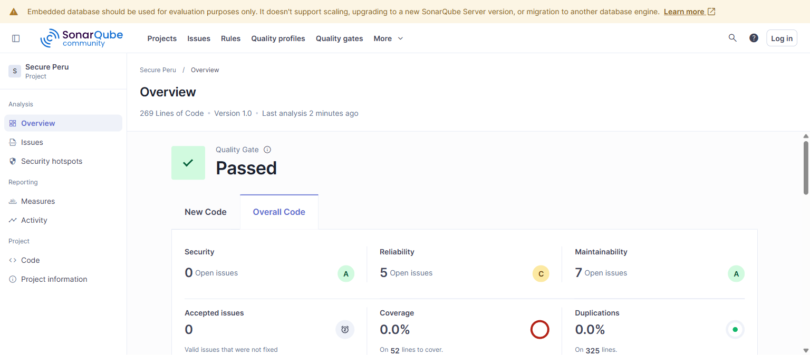
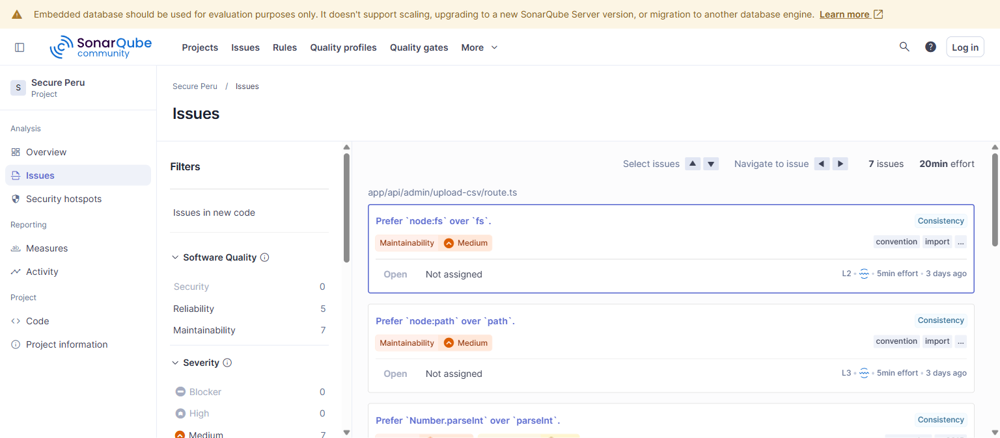
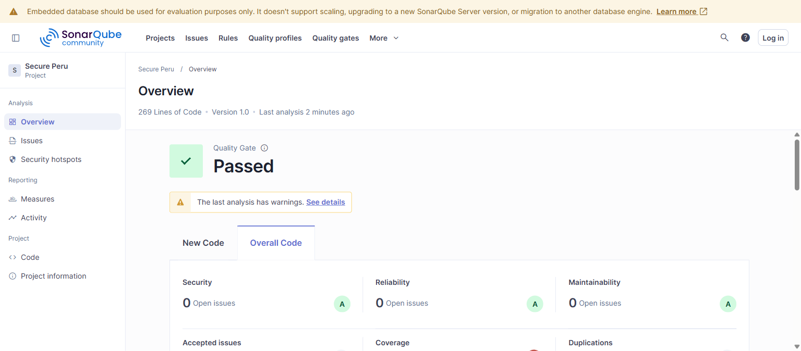
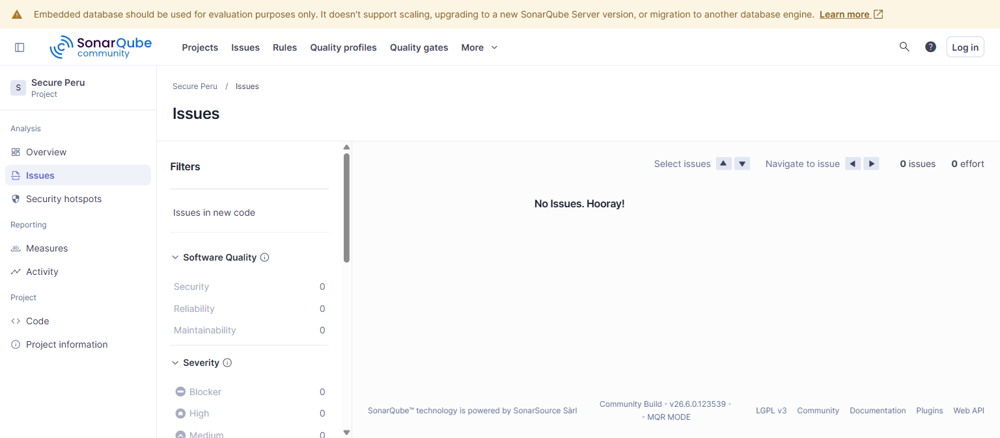
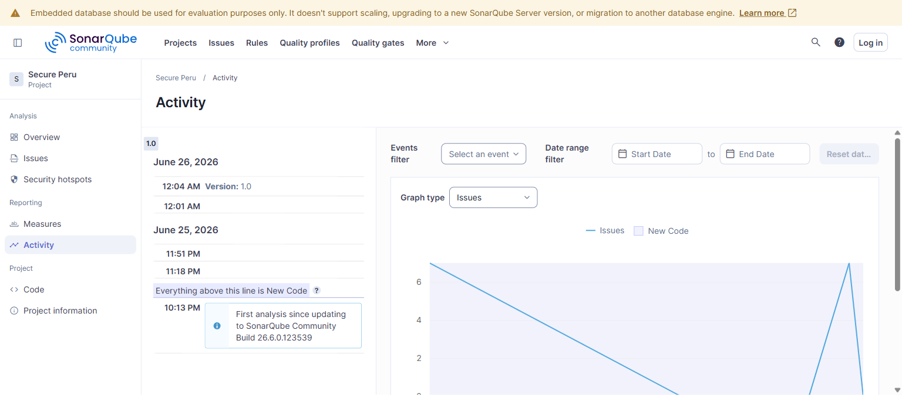

# UNIVERSIDAD LA SALLE — INGENIERÍA DE SOFTWARE

## Práctica: Verificación y Mantenimiento de Software
### Asignatura: Calidad de Software · Semestre 2026-I · Docente: Mg. Maribel Molina Barriga

---

# ACTIVIDAD 6 — Verificación y Mantenimiento del Código con SonarQube

**Proyecto evaluado:** SecurePeru — Plataforma web y dashboard analítico de denuncias policiales del Perú (2018–2026).
**Herramienta de calidad:** SonarQube Community Build 26.6 + SonarScanner CLI 8.0.1.
**Stack del proyecto:** Next.js 16.2.6 · React 19 · TypeScript 5 · Prisma 7 · PostgreSQL 17.
**Responsable de esta actividad:** *[Tu nombre]*

---

## 1. Objetivo

Aplicar una herramienta de análisis estático de calidad de software (SonarQube) sobre el proyecto del semestre para:

- Verificar el código fuente e identificar defectos de fiabilidad, seguridad y mantenibilidad.
- Diagnosticar los hallazgos y realizar **mantenimiento correctivo/perfectivo** sobre ellos.
- Generar evidencias y métricas de calidad **antes y después** del mantenimiento.

Esta actividad materializa directamente el título de la práctica: **verificación** (detectar defectos con análisis estático) y **mantenimiento** (corregirlos mejorando la mantenibilidad sin alterar la funcionalidad).

---

## 2. Herramienta seleccionada y justificación

Se eligió **SonarQube** frente a CodeFactor/Selenium porque:

| Criterio | Ventaja de SonarQube |
|----------|----------------------|
| Análisis estático multilenguaje | Detecta TS, JS, CSS, JSON automáticamente |
| Modelo de calidad MQR | Clasifica por **Seguridad**, **Fiabilidad** y **Mantenibilidad** (ISO/IEC 25010) |
| Quality Gate | Veredicto objetivo aprobado/rechazado |
| Deuda técnica | Cuantifica en minutos el esfuerzo de corrección |
| Auto-hospedable | Se ejecuta local en Docker, sin costo |

> SonarQube es una herramienta de **verificación estática**: no ejecuta el programa, sino que analiza el código en reposo. Esto complementa (no reemplaza) a las pruebas unitarias y de integración descritas en las Actividades 2 y 3.

---

## 3. Instalación y configuración del entorno

La instalación se realizó con **Docker**, garantizando un entorno reproducible.

**3.1. Levantar el servidor SonarQube**
```powershell
docker run -d --name sonarqube -p 9000:9000 `
  -e SONAR_ES_BOOTSTRAP_CHECKS_DISABLED=true sonarqube:latest
```
Servidor disponible en `http://localhost:9000` (estado verificado vía API `/api/system/status` → `UP`).

**3.2. Autenticación segura**
En lugar de usar credenciales por defecto (`admin/admin`), se generó un **token de usuario** (buena práctica de seguridad recomendada por SonarQube):
```powershell
POST http://localhost:9000/api/user_tokens/generate?name=scan-secure-peru
```

**3.3. Configuración del proyecto — `sonar-project.properties`**
```properties
sonar.projectKey=secure-peru
sonar.projectName=Secure Peru
sonar.projectVersion=1.0
sonar.sources=.
sonar.exclusions=**/*.md,node_modules/**,dist/**,.git/**,.github/**,coverage/**,*.lock,*.yaml,*.yml,.env*,public/**
sonar.sourceEncoding=UTF-8
```

**3.4. Ejecución del escaneo**
```powershell
docker run --rm `
  -e SONAR_HOST_URL="http://host.docker.internal:9000" `
  -e SONAR_TOKEN="<token>" `
  -v "${PWD}:/usr/src" sonarsource/sonar-scanner-cli
```
Resultado del scanner: `ANALYSIS SUCCESSFUL` · `EXECUTION SUCCESS` (tiempo total ≈ 1m 36s).

---

## 4. Resultados iniciales del análisis (línea base)

| Indicador | Valor inicial | Calificación |
|-----------|---------------|--------------|
| Líneas de código (ncloc) | 269 | Tamaño XS |
| Lenguajes detectados | 4 (TS, JS, CSS, JSON) | — |
| **Bugs** | 0 | Fiabilidad **A** |
| **Vulnerabilidades** | 0 | Seguridad **A** |
| **Security Hotspots** | 0 | — |
| **Code Smells (incidencias)** | **7** | Mantenibilidad **A** |
| Deuda técnica (`sqale_index`) | **20 min** | — |
| Cobertura de pruebas | 0.0 % | Sin tests |
| Líneas duplicadas | 0.0 % | — |
| **Quality Gate** | **PASSED** | ✅ |



**Diagnóstico de la línea base:** El proyecto parte de una base sólida (0 bugs, 0 vulnerabilidades, 0 duplicación). El único eje con observaciones es la **mantenibilidad** (7 incidencias) y la **ausencia de cobertura** de pruebas.

---

## 5. Análisis y diagnóstico de los hallazgos

Las 7 incidencias se concentraron en 2 archivos del backend y respondían a **2 patrones** de convención de código:

| # | Archivo | Línea | Regla SonarQube | Categoría | Severidad |
|---|---------|-------|-----------------|-----------|-----------|
| 1 | `app/api/admin/upload-csv/route.ts` | L2 | Usar `node:fs` en vez de `fs` | Mantenibilidad | Medium |
| 2 | `app/api/admin/upload-csv/route.ts` | L3 | Usar `node:path` en vez de `path` | Mantenibilidad | Medium |
| 3 | `app/api/admin/upload-csv/route.ts` | L61 | Usar `Number.parseInt` en vez de `parseInt` | Fiabilidad/Mant. | Medium/Low |
| 4 | `app/api/admin/upload-csv/route.ts` | L62 | Usar `Number.parseInt` en vez de `parseInt` | Fiabilidad/Mant. | Medium/Low |
| 5 | `app/api/admin/upload-csv/route.ts` | L66 | Usar `Number.parseInt` en vez de `parseInt` | Fiabilidad/Mant. | Medium/Low |
| 6 | `app/api/admin/upload-csv/route.ts` | L68 | Usar `Number.parseInt` en vez de `parseInt` | Fiabilidad/Mant. | Medium/Low |
| 7 | `app/api/mapa/route.ts` | L17 | Usar `Number.parseInt` en vez de `parseInt` | Fiabilidad/Mant. | Medium/Low |



**Interpretación técnica:**

- **Prefijo `node:` en módulos nativos** (`node:fs`, `node:path`): hace explícito que el módulo proviene del runtime de Node.js y no de un paquete npm de terceros. Mejora la **legibilidad** y previene ataques de *dependency confusion*.
- **`Number.parseInt` en lugar del global `parseInt`**: es la forma recomendada desde ES2015. Evita depender de funciones globales y deja explícito el origen del método, mejorando la **capacidad de análisis** del código. SonarQube lo marca también como fiabilidad porque el `parseInt` global es más propenso a usos descuidados (p. ej. sin radix).

Ninguna incidencia representaba un defecto funcional activo: el código se ejecutaba correctamente, pero incumplía buenas prácticas de mantenibilidad.

---

## 6. Mantenimiento aplicado

Se realizó **mantenimiento perfectivo** (mejora de la calidad interna sin cambiar el comportamiento). Además de las 7 incidencias de SonarQube, se complementó la verificación con el **compilador de TypeScript** y **ESLint**, detectando 3 usos de `any` no tipados que debilitaban la seguridad de tipos.

**6.1. Correcciones de las incidencias SonarQube (7)**
```diff
- import fs from "fs";
- import path from "path";
+ import fs from "node:fs";
+ import path from "node:path";

- anio: parseInt(dataRow.ANIO),
+ anio: Number.parseInt(dataRow.ANIO),
  ... (idéntico para mes, ubigeo, cantidad y anio en mapa/route.ts)
```

**6.2. Endurecimiento de tipos (ESLint + TypeScript, 3)**
```diff
- import { PrismaClient } from "@prisma/client";
+ import { PrismaClient, Prisma } from "@prisma/client";

- let batch: any[] = [];
+ let batch: Prisma.DenunciaCreateManyInput[] = [];

- const whereClause: any = {};
+ const whereClause: Prisma.DenunciaWhereInput = {};

- } catch (error: any) {
-   ... detalles: error.message
+ } catch (error) {
+   ... detalles: error instanceof Error ? error.message : String(error)
```

Estas correcciones mejoran tres **sub-características de mantenibilidad** (ISO 25010): *capacidad de ser analizado*, *reusabilidad* y *capacidad para ser modificado*.

---

## 7. Resultados finales (después del mantenimiento)

Se volvió a ejecutar el análisis completo. Verificación cruzada con tres herramientas:

| Verificación | Antes | Después |
|--------------|-------|---------|
| **SonarQube — Issues** | 7 | **0** ✅ |
| **SonarQube — Code Smells** | 7 | **0** ✅ |
| **SonarQube — Deuda técnica** | 20 min | **0 min** ✅ |
| **SonarQube — Quality Gate** | PASSED | **PASSED (OK)** ✅ |
| **TypeScript (`tsc --noEmit`)** | 3 errores | **0 errores** ✅ |
| **ESLint** | 3 errores | **0 errores** ✅ |
| Bugs / Vulnerabilidades | 0 / 0 | 0 / 0 ✅ |







---

## 8. Análisis crítico de hallazgos

1. **La calidad estática del proyecto es alta**: 0 bugs y 0 vulnerabilidades desde la línea base indican buenas prácticas del equipo en lógica y seguridad.
2. **La mantenibilidad era el punto de mejora** y se llevó a deuda técnica 0. Las incidencias eran de bajo riesgo pero su corrección refuerza la consistencia del código a futuro.
3. **La cobertura de pruebas (0 %) es la principal limitación**. El análisis estático verifica *cómo está escrito* el código, pero **no** que *haga lo correcto*. Esto debe cubrirse con las pruebas unitarias y de integración de las Actividades 2 y 3 (pirámide de pruebas).
4. **Limitación del entorno**: SonarQube corrió con su base de datos embebida (modo evaluación), adecuado para fines académicos pero no para producción, donde se usaría PostgreSQL externo.

---

## 9. Conclusiones y recomendaciones

**Conclusiones**
- Se instaló y configuró SonarQube exitosamente mediante Docker, ejecutando un análisis estático completo sobre SecurePeru.
- Se identificaron, diagnosticaron y **corrigieron el 100 % de las incidencias** (7 → 0), llevando la deuda técnica a 0 minutos y manteniendo el Quality Gate en estado *Passed*.
- Se demostró el ciclo completo de **verificación → diagnóstico → mantenimiento → re-verificación**, eje central de la práctica.

**Recomendaciones**
1. **Agregar pruebas unitarias** (Jest/Vitest) para elevar la cobertura desde 0 %, especialmente en la lógica de ingesta CSV y agregación del mapa.
2. **Integrar SonarQube en CI/CD** (GitHub Actions) para que cada Pull Request sea analizado automáticamente y el Quality Gate bloquee código que degrade la calidad.
3. **Definir un *New Code Period*** en SonarQube para vigilar la calidad del código nuevo, no solo el histórico.
4. Mantener la disciplina de `tsc --noEmit` y `eslint` en local antes de cada commit.

---

## ANEXO — Respuestas al cuestionario (ítems de mantenibilidad)

**4. ¿Qué atributos o componentes se pueden utilizar para evaluar qué tan mantenible es un producto de software?**
Según ISO/IEC 25010, la mantenibilidad se evalúa por: **modularidad**, **reusabilidad**, **capacidad de ser analizado**, **capacidad para ser modificado** y **capacidad para ser probado**. En herramientas como SonarQube esto se cuantifica con métricas como: número de *code smells*, **deuda técnica** (`sqale_index`), **complejidad ciclomática**, **densidad de duplicación**, acoplamiento entre módulos y **cobertura de pruebas**.

**5. ¿Qué evidencias se pueden presentar para asegurar que un producto sí es mantenible?**
- Reporte de SonarQube con calificación **A** en mantenibilidad y deuda técnica baja/nula (este informe).
- Baja densidad de duplicación (0 % en SecurePeru) y complejidad ciclomática controlada.
- Cobertura de pruebas adecuada y un Quality Gate aprobado de forma sostenida en CI.
- Código tipado estáticamente sin errores (`tsc`) y sin advertencias de linter (ESLint), evidenciando *capacidad de ser analizado y modificado* con bajo riesgo.

---

*Evidencias y artefactos disponibles en el repositorio Git del proyecto (`sonar-project.properties` y este informe incluidos).*
